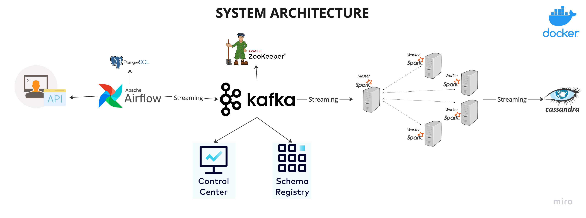

# stream-data-pipeline
## OVERVIEW
This is a project evolves an end to end streaming data pipeline and containerization with Docker.   

### Description
The Data source use for this project is streamed from the random user API in JSON. The pipeline provides covers the ETL in dtail from ingestion with, Apache Kakfa, orchestration with Airflow, and Cassandra DB for storage. Containerizing our data pipeline with Docker enables ease of deployment, scalabilty and reproducability. 

### Data Pipeline architecture 

Explanation of system architecture components.
-  Ingestion layer API: Random user API
-   Apache Airflow: This is the orchestration tool responsible for managing the data workflows in the forms of DAGs with tasks from storing data from API to Database.
-   Apache Kafka and Zookeeper: This is use for message rending of streamed data from PostgreSQL to the processing engine.
- Control Center and Schema Registry: This serve for monitoring and schema management respectively for Kafka streams.
-   Apache Spark: This is for data processing and optimize for streaming data as in our case. 
- Cassandra : Storing our processed data.

### Clone and run Project
- Git clone <repo>
- cd STREAM-DATA-PIPELINE
- python3 -m env env
- Source env/bin/activate
- docker-compose up 

